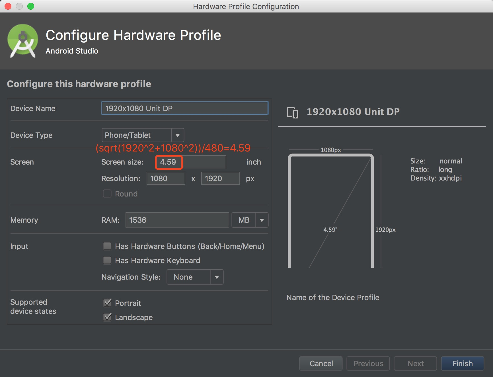

<p align="center">
   <a href="https://bintray.com/jessyancoding/maven/autosize/_latestVersion">
    
  </a>
  <a href="https://travis-ci.org/JessYanCoding/AndroidAutoSize">
    
  </a>
  <a href="https://developer.android.com/about/versions/android-4.0.html">
    
  </a>
  <a href="http://www.apache.org/licenses/LICENSE-2.0">
    
  </a>
  <a href="https://www.jianshu.com/u/1d0c0bc634db">
    
  </a>
  <a href="https://shang.qq.com/wpa/qunwpa?idkey=1a5dc5e9b2e40a780522f46877ba243eeb64405d42398643d544d3eec6624917">
    
  </a>
</p>

<p align="center">
  <a href="README-zh.md">
    <b>中文说明</b>
  </a>
</p>

## A low-cost Android screen adaptation solution (今日头条屏幕适配方案终极版，一个极低成本的 Android 屏幕适配方案).

## Overview
### Pixel 2 XL | 1440 x 2880 | 560dpi:
<p>
   
   
   
</p>

### Pixel XL | 1440 x 2560 | 560dpi:
<p>
   
   
   
</p>

### Nexus 5X | 1080 x 1920 | 420dpi:
<p>
   
   
   
</p>

### Nexus 4 | 768 x 1280 | 320dpi:
<p>
   
   
   
</p>

### Nexus S | 480 x 800 | 240dpi:
<p>
   
   
   
</p>

## Notice
* [Devices Info](https://material.io/tools/devices/)

* [Introduction of function](https://juejin.im/post/5bce688e6fb9a05cf715d1c2)

* [Framework analysis](https://juejin.im/post/5b7a29736fb9a019d53e7ee2)

* [Common Issues](https://github.com/JessYanCoding/AndroidAutoSize/issues/13)

* [Android advanced framework](https://github.com/JessYanCoding/MVPArms)

## Download
``` gradle
 implementation 'me.jessyan:autosize:1.0.5'
```

## Usage
### Step 1 (just one steps) 
* **Initialize in AndroidManifest, if you use a subunits, you can write the pixel size, no need to convert the pixel to dp, please see [demo-subunits](https://github.com/JessYanCoding/AndroidAutoSize/tree/master/demo-subunits)**
```xml
<manifest>
    <application>            
        <meta-data
            android:name="design_width_in_dp"
            android:value="360"/>
        <meta-data
            android:name="design_height_in_dp"
            android:value="640"/>           
     </application>           
</manifest>
```

<a name="preview"></a>
## Preview
* Real-time preview during layout is an important part of the development phase, in many cases, the default preview device provided by **Android Studio** does not fully display our design, so we need to create the virtual device ourselves, under the **dp, pt, in, mm** four units of virtual device creation method

* If you don't want the status bar and navigation bar to appear in **Preview** during preview, you can select the **panel** theme according to the following image, after using this theme, the vertical resolution just fills the entire preview page


* Virtual device creation method


### DP
* If you use **dp** as a unit in the **layout** file for layout (**AndroidAutoSize** supports **dp, sp** for layout by default), you can find the screen size according to the formula **(sqrt(vertical resolution^2 + horizontal resolution^2))/dpi** and create an virtual device (**write screen size and resolution only**)


### PT
* If you use **pt** as a unit in the **layout** file for layout (requires **AutoSizeConfig.getInstance().getUnitsManager().setSupportSubunits(Subunits.PT);** to open **pt** support), you can find the screen size according to the formula **(sqrt(vertical resolution^2 + horizontal resolution^2))/72** and create an virtual device (**write screen size and resolution only**)


### IN
* If you use **in** as a unit in the **layout** file for layout (requires **AutoSizeConfig.getInstance().getUnitsManager().setSupportSubunits(Subunits.IN);** to open **in** support), you can find the screen size according to the formula **sqrt(vertical resolution^2 + horizontal resolution^2)** and create an virtual device (**write screen size and resolution only**)


### MM
* If you use **mm** as a unit in the **layout** file for layout (requires **AutoSizeConfig.getInstance().getUnitsManager().setSupportSubunits(Subunits.MM);** to open **mm** support), you can find the screen size according to the formula **(sqrt(vertical resolution^2 + horizontal resolution^2))/25.4** and create an virtual device (**write screen size and resolution only**)


## Advance (see demo)

### Activity
* **Customize the adaptation parameters of the Activity:**
```java
public class CustomAdaptActivity extends AppCompatActivity implements CustomAdapt {

    @Override
    public boolean isBaseOnWidth() {
        return false;
    }

    @Override
    public float getSizeInDp() {
        return 667;
    }
}
```

* **Cancel the adaptation of the Activity:**
```java
public class CancelAdaptActivity extends AppCompatActivity implements CancelAdapt {

}
```

### Fragment
* **First enable the ability to support Fragment custom parameters**
```java
AutoSizeConfig.getInstance().setCustomFragment(true);
```

* **Customize the adaptation parameters of the Fragment:**
```java
public class CustomAdaptFragment extends Fragment implements CustomAdapt {

    @Override
    public boolean isBaseOnWidth() {
        return false;
    }

    @Override
    public float getSizeInDp() {
        return 667;
    }
}
```

* **Cancel the adaptation of the Fragment:**
```java
public class CancelAdaptFragment extends Fragment implements CancelAdapt {

}
```

### Subunits (see demo-subunits)
* You can choose one of the three unpopular units of **pt, in, mm** as the subunits, the subunits is used to avoid the adverse effects caused by modifying **DisplayMetrics#density**, after using the subunits, you can write the pixel size on the design, you don't need to convert it to **dp**


```java
AutoSizeConfig.getInstance().getUnitsManager()
        .setSupportDP(false)
        .setSupportSP(false)
        .setSupportSubunits(Subunits.MM);
```


## Donate
 

## About Me
* **Email**: <jess.yan.effort@gmail.com>
* **Home**: <http://jessyan.me>
* **掘金**: <https://juejin.im/user/57a9dbd9165abd0061714613>
* **简书**: <https://www.jianshu.com/u/1d0c0bc634db>

## License
```
 Copyright 2018, jessyan

   Licensed under the Apache License, Version 2.0 (the "License");
   you may not use this file except in compliance with the License.
   You may obtain a copy of the License at

       http://www.apache.org/licenses/LICENSE-2.0

   Unless required by applicable law or agreed to in writing, software
   distributed under the License is distributed on an "AS IS" BASIS,
   WITHOUT WARRANTIES OR CONDITIONS OF ANY KIND, either express or implied.
   See the License for the specific language governing permissions and
   limitations under the License.
```
